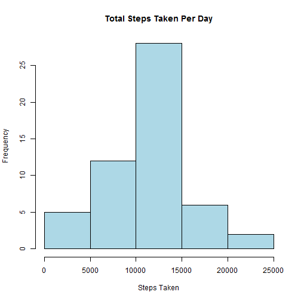
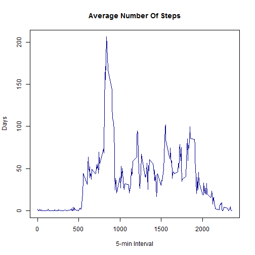
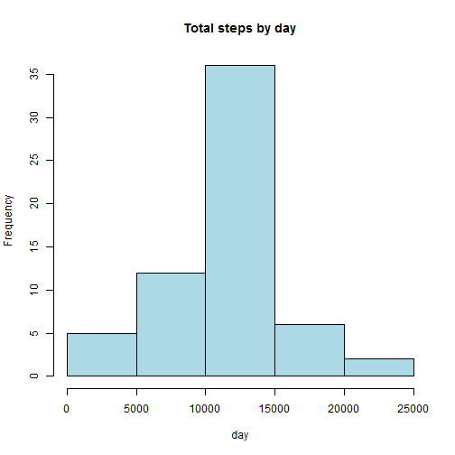
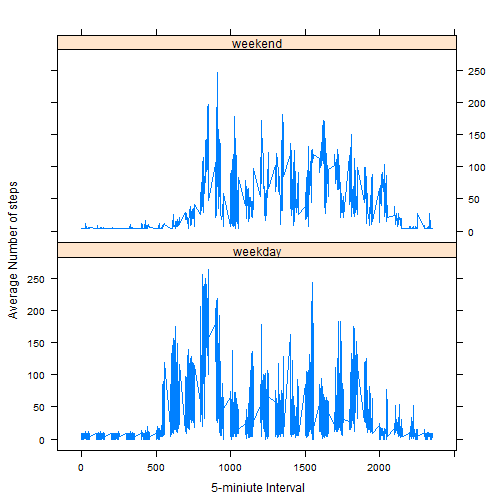

## Introduction

This assignment is Peer Assessment 1 in the Coursera course "Reproducible Research", which loads and performs analysis on a set of  activity monitoring data.


### Background
It is now possible to collect a large amount of data about personal movement using activity monitoring devices such as a Fitbit, Nike Fuelband, or Jawbone Up. These type of devices are part of the "quantified self" movement - a group of enthusiasts who take measurements about themselves regularly to improve their health, to find patterns in their behavior, or because they are tech geeks. But these data remain under-utilized both because the raw data are hard to obtain and there is a lack of statistical methods and software for processing and interpreting the data.

This assignment makes use of data from a personal activity monitoring device. This device collects data at 5 minute intervals through out the day. The data consists of two months of data from an anonymous individual collected during the months of October and November, 2012 and include the number of steps taken in 5 minute intervals each day.

### About The Data
The data for this assignment can be downloaded from the course web site:

- **Dataset**: Activity monitoring data [52K]

The variables included in this dataset are:

- **steps**: Number of steps taking in a 5-minute interval (missing values are coded as **`NA`**)

- **date**: The date on which the measurement was taken in YYYY-MM-DD format

- **interval**: Identifier for the 5-minute interval in which measurement was taken

The dataset is stored in a comma-separated-value (CSV) file and there are a total of 17,568 observations in this dataset.

## Assignment

### Loading and preprocessing the data
1.  Load the data:


```
##   steps       date interval
## 1    NA 2012-10-01        0
## 2    NA 2012-10-01        5
## 3    NA 2012-10-01       10
## 4    NA 2012-10-01       15
## 5    NA 2012-10-01       20
## 6    NA 2012-10-01       25
```

```
## [1] "steps"    "date"     "interval"
```

2.  Process/transform the data (if necessary) into a format suitable for  analysis:


```r
activity$date <- as.Date( activity$date, "%Y-%m-%d" )

head( activity )
```

```
##   steps       date interval
## 1    NA 2012-10-01        0
## 2    NA 2012-10-01        5
## 3    NA 2012-10-01       10
## 4    NA 2012-10-01       15
## 5    NA 2012-10-01       20
## 6    NA 2012-10-01       25
```

### What is mean total number of steps taken per day?
1. Calculate the total number of steps taken per day.  Using the `activity` dataframe, calculate the `sum` of all steps for each day (filtering out `NA` values):


```r
StepsTotal <- aggregate( steps ~ date
                         , data = activity
                         , FUN = sum
                         , na.rm = TRUE 
                         )
names( StepsTotal ) <- c( "date", "steps" )
head( StepsTotal )
```

```
##         date steps
## 1 2012-10-02   126
## 2 2012-10-03 11352
## 3 2012-10-04 12116
## 4 2012-10-05 13294
## 5 2012-10-06 15420
## 6 2012-10-07 11015
```

2. Make a histogram of the total number of steps taken each day:


```r
hist( StepsTotal$steps
      , main = "Total Steps Taken Per Day"
      , xlab = "Steps Taken"
      , col = "lightblue"
      )
```

 

3.  Calculate and report the mean and median of the total number of steps taken per day:


```r
mean( StepsTotal$steps )
```

```
## [1] 10766.19
```

```r
median( StepsTotal$steps )
```

```
## [1] 10765
```

### What is the average daily activity pattern?

1.  Make a time series plot (i.e. `type = "l"`) of the 5-minute interval (x-axis) and the average number of steps taken, averaged across all days (y-axis), removing `NA` values:


```r
meanDaily <- aggregate( activity$steps
                        , by = list( activity$interval )
                        , FUN = mean
                        , na.rm=TRUE
                        )

names( meanDaily ) <- c( "interval", "mean" )

head( meanDaily )
```

```
##   interval      mean
## 1        0 1.7169811
## 2        5 0.3396226
## 3       10 0.1320755
## 4       15 0.1509434
## 5       20 0.0754717
## 6       25 2.0943396
```

```r
plot( meanDaily$interval
      , meanDaily$mean
      , type = "l"
      , xlab = "5-min Interval"
      , ylab = "Days"
      , main = "Average Number Of Steps"
      , col = "darkblue"
      )
```

 

2.  Which 5-minute interval, on average across all the days in the dataset, contains the maximum number of steps?:


```r
pos <- which( meanDaily$mean == max( meanDaily$mean ))
maxInterval <- meanDaily[ pos, 1 ]
maxInterval
```

```
## [1] 835
```

Interval **835** is the one with the most steps.


### Inputing missing values
1.  Calculate and report the total number of missing values in the dataset (i.e. the total number of rows with `NA`s):


```r
activity.missing <- sum( is.na( activity ) )
activity.missing
```

```
## [1] 2304
```

There are **2304** missing values in the data set.

2.  Devise a strategy for filling in all of the missing values in the dataset. The strategy does not need to be sophisticated. For example, you could use the mean/median for that day, or the mean for that 5-minute interval, etc.:


```r
# create a vector of the positions in the dataframe with NA values
pos.NA <- which( is.na( activity$steps ) )

# create a vector of means
fill.missing <- rep( mean( activity$steps, na.rm = TRUE )
                     , times = length( pos.NA )
                     )
```

3.  Use the `fill.missing` vector to create a copy of the `activity` dataset with `NA`s filled in:


```r
activity.filled <- activity

activity.filled[ pos.NA, "steps" ] <- fill.missing
```

Confirm that the new data.frame has no missing values:


```r
sum( is.na( activity.filled ) )
```

```
## [1] 0
```

4.  Make a histogram of the total number of steps taken each day and Calculate and report the **mean** and **median** total number of steps taken per day.  First, create a new total step dataframe:


```r
StepsTotal2 <- aggregate(steps ~ date
                        , data = activity.filled
                        , sum
                        , na.rm = TRUE
                        )
```

And plot the histogram:


```r
hist( StepsTotal2$steps
      , main = "Total steps by day"
      , xlab = "day"
      , col = "lightblue"
      )
```

 

The mean and median for the filled-in dataframe are:


```r
mean( StepsTotal2$steps )
```

```
## [1] 10766.19
```

```r
median( StepsTotal2$steps )
```

```
## [1] 10766.19
```

Comparing the step counts in `StepsTotal` (with missing values) ...


```r
summary( StepsTotal$steps )
```

```
##    Min. 1st Qu.  Median    Mean 3rd Qu.    Max. 
##      41    8841   10760   10770   13290   21190
```

... to those in `StepsTotal2` (no missing values) ...


```r
summary( StepsTotal2$steps )
```

```
##    Min. 1st Qu.  Median    Mean 3rd Qu.    Max. 
##      41    9819   10770   10770   12810   21190
```

... it can be seen that the **mean** remains the same, but the **median** shifts up by 10.

### Are there differences in activity patterns between weekdays and weekends?

1.  Create a new factor variable in the dataset with two levels - "weekday" and "weekend" indicating whether a given date is a weekday or weekend day.


```r
day <- weekdays( activity.filled$date )

daylevel <- vector()

activity.filled$dayofweek <- tolower( weekdays( activity.filled$date ) )

activity.filled$daytype   <- ifelse( activity.filled$dayofweek == "saturday" | 
                                     activity.filled$dayofweek == "sunday"
                                 , "weekend"
                                 , "weekday" 
                                )

activity.filled$daytype <- factor( activity.filled$daytype )

#stepsByDay <- aggregate(steps ~ interval + daylevel, data = activity, mean)

#names(stepsByDay) <- c("interval", "daylevel", "steps")

head( activity.filled )
```

```
##     steps       date interval dayofweek daytype
## 1 37.3826 2012-10-01        0    monday weekday
## 2 37.3826 2012-10-01        5    monday weekday
## 3 37.3826 2012-10-01       10    monday weekday
## 4 37.3826 2012-10-01       15    monday weekday
## 5 37.3826 2012-10-01       20    monday weekday
## 6 37.3826 2012-10-01       25    monday weekday
```

2. Make a panel plot containing a time series plot (i.e. type = "l") of the 5-minute interval (x-axis) and the average number of steps taken, averaged across all weekday days or weekend days (y-axis).


```r
activity.mean <- aggregate( activity.filled$steps
                            , by = list( activity.filled$daytype
                                         , activity.filled$dayofweek
                                         , activity.filled$interval
                                         )
                            , mean
                            )

# give the columns meaningful names
names( activity.mean ) <- c( "daytype", "dayofweek", "interval", "mean" )

# display the top of the data frame
head( activity.mean )
```

```
##   daytype dayofweek interval     mean
## 1 weekday    friday        0 8.307244
## 2 weekday    monday        0 9.418355
## 3 weekend  saturday        0 4.672825
## 4 weekend    sunday        0 4.672825
## 5 weekday  thursday        0 9.375844
## 6 weekday   tuesday        0 0.000000
```

```r
# generate the plot
xyplot(mean ~ interval | daytype
       , activity.mean
       , type = "l"
       , lwd = 1
       , xlab=" 5-miniute Interval"
       , ylab="Average Number of steps"
       , layout = c( 1, 2 ) 
       )
```

 

Cursory analysis of the plot shows a tendency for activity (steps taken) to start later in the day on weekends.

